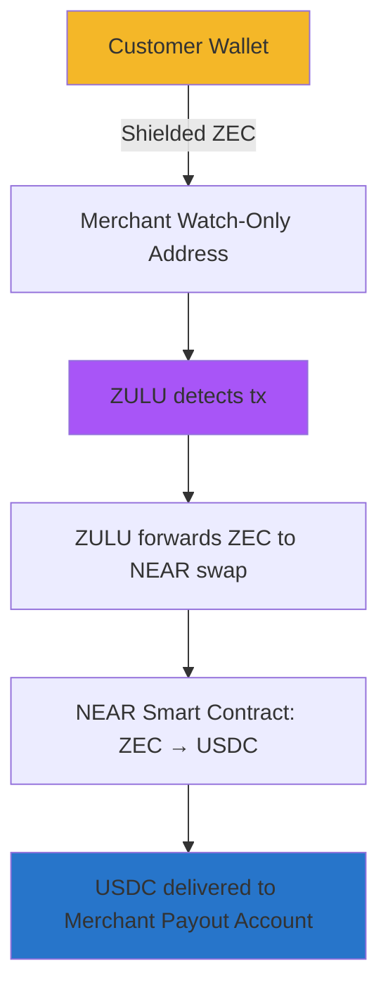

# 🛡️ ZULU — Private AI Agent for Zcash Commerce

<div align="center">

[](https://zypherpunk.xyz)
[](https://z.cash)
[](LICENSE)
[](https://zulu.cash)

**Local-First AI • Shielded Payments • Cross-Chain Settlement**

[Website](https://zulu.cash) • [Lite Paper](docs/litepaper.md) • [Architecture](docs/architecture-diagram.png) • [Build Log](docs/build-log.md)

</div>

---

## 📖 Table of Contents

- [Overview](#-overview)
- [Why Build ZULU?](#-why-build-zulu)
- [What ZULU Does](#-what-zulu-does)
- [ZEC → USDC Flow](#-zec--usdc-flow)
- [Architecture](#-architecture)
- [Repository Structure](#-repository-structure)
- [Build Timeline](#-build-timeline)
- [Getting Started](#%EF%B8%8F-getting-started)
- [Contributing](#-contributing)
- [Security](#%EF%B8%8F-security-notes)
- [Follow the Build](#-follow-the-build)

---

## 🌟 Overview

**ZULU** is an experiment at the intersection of **private AI**, **shielded Zcash payments**, and **cross-chain settlement**.

Developed openly during the [Zypherpunk Zcash Hackathon](https://zypherpunk.xyz) as a proof-of-concept for privacy-preserving, merchant-ready payments.

### Our Mission

> Create the world's first private, local-first AI agent that helps users pay with ZEC while merchants receive USDC — without surveillance, without data leakage, and without custodial risk.

This repository contains the codebase, architecture docs, prototypes, and public development logs.

---

## 📣 Why Build ZULU?

AI is becoming the default interface for personal finance.  
**But AI + Finance = Surveillance** unless designed differently.

### The Problem

If AI can read every payment you make, you lose:

- ❌ **Anonymity**
- ❌ **Bargaining power**
- ❌ **Financial privacy**
- ❌ **Personal safety**
- ❌ **Control over your money**

### The Solution

**Zcash** solves private transactions.  
**ZULU** solves private financial intelligence.

```
Local AI + Shielded ZEC + Cross-chain settlement
→ A new class of private, compliant commerce
```

---

## 🧩 What ZULU Does

> **Hackathon Build • Evolving Daily**

### ✅ 1. Local-First Private AI

- Powered by **Phi-3 Mini** via **Ollama** (on-device)
- All intelligence happens **locally**
- **No** cloud inference
- **No** logs
- **No** telemetry
- **No** server calls
- **No** leak of financial data

**ZULU is the first AI agent that can answer:**

```
"How much did I spend this month?"
"What are my biggest payments?"
"Which new addresses appeared in my history?"
"What transactions look unusual?"
```

…without sending a single byte to the cloud.

### ✅ 2. Watch-Only Transaction Detection

ZULU never touches or requests spending keys.

- ✓ Uses **incoming viewing keys only**
- ✓ Connects to `lightwalletd` to detect shielded notes
- ✓ Writes all events to a private ledger (encrypted)
- ✓ Supports both user-side wallets and merchant-side POS flow

> Your money never flows through ZULU — only your encrypted metadata does.

### ✅ 3. ZEC → USDC Settlement Engine (Prototype)

**NEW:** Cross-chain settlement using **NEAR Protocol**.

**Flow:**

1. User pays merchant in **shielded ZEC**
2. ZULU detects payment via view key
3. ZULU forwards ZEC to the NEAR swap module
4. Smart contracts handle **ZEC → USDC**
5. USDC is delivered to the merchant's payout account

**Result:**
- ✓ Merchant gets stablecoins
- ✓ User stays private
- ✓ ZULU holds no custody

This unlocks **private ZEC payments with stable-value merchant settlement** — no volatility, no surveillance, no banks.

### ✅ 4. Encrypted Local Ledger (SQLCipher)

All data stays on-device.

- Encrypted transactional metadata
- Merchant payment logs
- Pricing snapshots
- ZEC ↔ USD conversion data
- AI-readable ledger summaries

> ZULU is built for local-first privacy, not cloud analytics.

### ✅ 5. Build-in-Public Transparency

Every architecture change, experiment, and discussion is documented.

- Build logs updated daily
- Real-time website updates ([zulu.cash](https://zulu.cash))
- Lite paper + investor 1-pager included
- Open collaboration encouraged

**No stealth mode. No hidden roadmap. Everything evolves publicly.**

---

## 🔄 ZEC → USDC Flow



### Guarantees

| Feature | Status |
|---------|--------|
| User identity stays private | ✅ |
| Merchant receives stablecoins | ✅ |
| Zero custodial risk | ✅ |
| No linking user → merchant | ✅ |
| No centralized payment processor | ✅ |
| No surveillance | ✅ |

---

## 🧱 Architecture

### 1. ZULU Core

- **Local AI engine** (Ollama → Phi-3 Mini)
- **SQLCipher encrypted ledger**
- **ZEC transaction watchers** (lightwalletd)
- **NEAR-based swap engine**
- **Heuristics + safe-send module**
- **USD/ZEC pricing indexer** (local snapshot)

### 2. User Side

- Uses their own Zcash wallet
- No keys ever flow through ZULU
- All spending remains fully shielded
- No KYC, fully private

### 3. Merchant Side

- Provides a view key (not spending key)
- ZULU detects incoming TX
- Swap module auto-converts ZEC → USDC
- USDC delivered to merchant's settlement account

### 4. Privacy Design

| Component | Privacy Feature |
|-----------|----------------|
| Telemetry | ❌ None |
| Server logging | ❌ None |
| Cookies | ❌ None |
| Cloud inference | ❌ None |
| Data vault | ✅ Encrypted |
| Custody | ✅ Self-custody preserved |
| Private keys | ✅ Never imported |

---

## 📦 Repository Structure

```
zulu/
├── backend/
│   ├── src/
│   │   ├── ai/            # Local AI model runner (Ollama)
│   │   ├── ledger/        # SQLCipher encrypted ledger
│   │   ├── zec/           # lightwalletd clients + watchers
│   │   ├── near/          # ZEC → USDC swap engine
│   │   ├── merchant/      # POS pricing, QR, detection
│   │   └── utils/
│   ├── tests/
│   ├── README.md
│   └── package.json
│
├── frontend/
│   ├── app/               # zulu.cash website
│   ├── components/
│   └── public/
│
├── docs/
│   ├── litepaper.md
│   ├── investor-one-pager.md
│   ├── architecture-diagram.png
│   └── build-log.md
│
└── demo/
    ├── sample-wallet.json
    ├── sample-queries.txt
    └── walkthrough.mp4
```

---

## 📅 Build Timeline

> **Public Log • Updated Daily**

### Day 1 — Concept
- ✅ Private AI + Zcash idea sketched
- ✅ ZULU name registered
- ✅ Repo created

### Day 2 — Payment Flow
- ✅ ZEC → USDC via NEAR validated
- ✅ Architecture V1 drafted
- ✅ Sketch of POS flow

### Day 3 — Prototype
- ✅ Local AI working
- ✅ View-key detection integrated
- ✅ Website deployed at [zulu.cash](https://zulu.cash)

### Day 4 — Build-in-Public
- ✅ Full website redesign
- ✅ Lite paper + investor one-pager drafted
- ✅ Swap engine module stubbed
- ✅ Safety heuristics defined

### Day 5–10 — Current Focus
- 🔄 Merchant POS
- 🔄 Swap engine integration
- 🔄 Encrypted ledger sync
- 🔄 ZULU.chat agent personality
- 🔄 Mobile UI

*This log updates continually.*

---

## 🛠️ Getting Started

### Requirements

- Node.js 18+
- Ollama installed locally
- SQLCipher
- Zcash lightwalletd endpoint (testnet/mainnet)
- NEAR testnet account + RPC access

### Run Backend

```bash
cd backend
npm install
npm run dev
```

### Run Frontend

```bash
cd frontend
npm install
npm run dev
```

### Quick Test

```bash
# Install dependencies
npm run setup

# Run demo
npm run demo

# Test AI queries
npm run test:ai
```

---

## 🤝 Contributing

ZULU is **fully open to collaborators** — especially during the hackathon.

We welcome:

- 🔐 Zcash developers
- 🌉 NEAR smart contract engineers
- 🕵️ Privacy researchers
- 🤖 AI/LLM engineers
- 🎨 Frontend & UX designers
- 🔬 Cryptographers
- 🏆 Hackathon teammates

**How to contribute:**

1. Open an [Issue](../../issues)
2. Submit a [Pull Request](../../pulls)
3. DM on [X/Twitter](https://x.com/MyCrypt0world)

See [CONTRIBUTING.md](CONTRIBUTING.md) for guidelines.

---

## 🛡️ Security Notes

| Security Feature | Implementation |
|-----------------|----------------|
| Private keys | ❌ ZULU **never** asks for private keys |
| Viewing keys | ✅ Only needs viewing keys |
| Data storage | ✅ All data is local & encrypted |
| AI inference | ✅ Fully local (Ollama) |
| Cloud services | ❌ No cloud inference |
| Wallet custody | ⚠️ ZULU is **not** a wallet |
| Money transmission | ⚠️ ZULU is **not** a money transmitter |
| Swap custody | ✅ Swap module is non-custodial |

> See [SECURITY.md](SECURITY.md) for more information.

---

## 🪙 License

[MIT License](LICENSE) — open, transparent, remixable.

---

## 🟣 Follow the Build

<div align="center">

**Website:** [zulu.cash](https://zulu.cash)  
**X/Twitter:** [@MyCrypt0world](https://x.com/MyCrypt0world)  
**Hackathon:** [zypherpunk.xyz](https://zypherpunk.xyz)  
**GitHub:** [edgeconsultinglabs/zulu.cash](https://github.com/edgeconsultinglabs/zulu.cash)  
**Email:** team@zulu.cash

</div>

---

<div align="center">

## 🔥 Final Note

**ZULU is evolving daily.**

Every architecture change, code update, idea, failure, pivot, and experiment is documented publicly in this repo.

**If you're here, you're early.**  
**If you contribute, you're part of the story.**

---

*Built with ❤️ for the Zypherpunk Hackathon*  
*"Intelligence Without Surveillance"*

</div>
