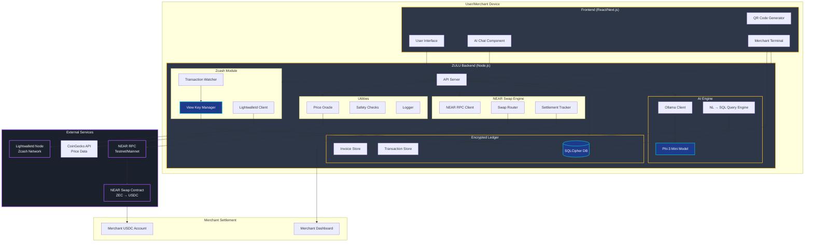

# ZULU Architecture Diagram

## Component Descriptions

### Frontend Components

**User Interface**
- Main application interface
- Merchant and user views
- Real-time payment status

**AI Chat Component**
- Natural language interface
- Query history
- Response formatting

**Merchant Terminal**
- Invoice generation
- Payment detection
- Settlement tracking

**QR Code Generator**
- Creates payment QRs
- Encodes amount and address
- Display and sharing

### Backend Modules

**AI Engine**
- Runs Phi-3 Mini locally via Ollama
- Converts natural language to SQL
- Generates insights and summaries
- No cloud inference

**Encrypted Ledger**
- SQLCipher-encrypted database
- Stores transaction metadata
- Merchant invoices and settlements
- Pricing snapshots

**Zcash Module**
- Connects to lightwalletd
- Watch-only via viewing keys
- Detects shielded transactions
- No private key access

**NEAR Swap Engine**
- Interfaces with NEAR contracts
- Routes ZEC → USDC swaps
- Tracks settlement status
- Non-custodial design

**Utilities**
- Price oracle (CoinGecko)
- Safety and risk checks
- Logging and monitoring
- Configuration management

### Data Flow

**User Payment Flow**
1. User scans merchant QR code
2. ZULU displays ZEC equivalent
3. User pays from their wallet
4. TxWatcher detects shielded payment
5. ZULU records in encrypted ledger
6. (Optional) Triggers NEAR swap
7. Merchant receives USDC

**AI Query Flow**
1. User asks question in natural language
2. Query engine converts to SQL
3. Queries encrypted local ledger
4. Returns formatted response
5. All processing stays on-device

**Privacy Guarantees**
- ✅ No private keys ever imported
- ✅ No cloud AI inference
- ✅ Encrypted local storage
- ✅ View-only Zcash access
- ✅ Non-custodial swap routing

## Security Boundaries

**Local Boundary** (Green)
- All user data stays within device
- Encrypted at rest
- No telemetry or logging

**External Services** (Purple)
- Minimal metadata exposure
- Standard RPC calls only
- No sensitive data shared

**Secure Components** (Blue)
- Encrypted database
- View key isolation
- Local AI model
